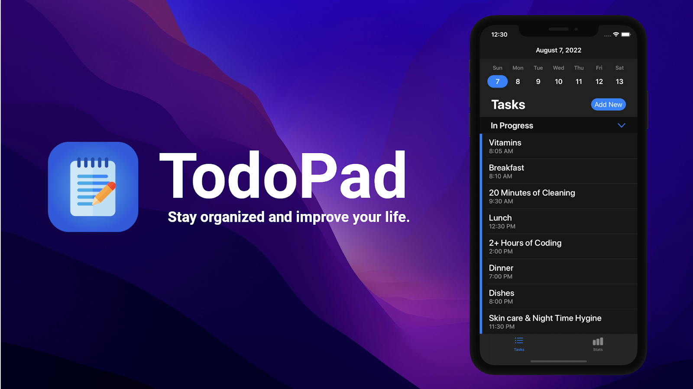

# TodoPad iOS 


[](https://apps.apple.com/ca/app/todopad/id1642068489)
 




TodoPad is a task/todo tracker app built with Swift for iOS. It helps users manage their daily tasks, stay organized, and stay motivated to achieve their life goals. With TodoPad, you can track and complete tasks, earn points and levels, and keep a record of your task completion history.

[](https://apps.apple.com/ca/app/todopad/id1642068489)

## Features

- **Task Management:** Add and manage unlimited tasks and to-dos.
- **Reminders & Notifications:** Schedule reminders and receive notifications for your tasks.
- **Leveling System:** Earn points and levels as you complete tasks, adding a gamified element to task management.
- **Tasks Completed Counter:** Keep track of the number of tasks you have completed.
- **Adherence Tracking:** Monitor your adherence to specific tasks over time.
- **Task Scheduling:** Set tasks to be persistent until completed, non-repeating on a specific day and time, or repeating at specified intervals.
- **Privacy-Focused:** TodoPad prioritizes user privacy by storing all data on the device and never uploading it to the internet.

## Technology Used:
- **UIKit:** The app is built using Apple's UIKit framework for creating the user interface and handling user interactions.
- **Core Data:** Apple's Core Data is employed for data persistence and managing the task/todo data.

## Architecture and Testing
- **MVVM:** TodoPad follows the Model-View-ViewModel (MVVM) architectural pattern, separating concerns and promoting a clear separation of data, views, and business logic.
- **Unit Testing:** The app incorporates unit testing using XCTest framework to ensure the reliability and functionality of critical components.

## Usage

1. Clone the repository.
```
git clone git@github.com:iamCodeBrah/README-Test.git
```

2. Open the project in Xcode.
```
cd TodoPad
open TodoPad.xcodeproj
```

3. Build and run the app using Xcode's simulator or by connecting your iOS device.

4. Explore the features of TodoPad and start managing your tasks efficiently!

## App Store
Get TodoPad on the App Store:

[](https://apps.apple.com/ca/app/todopad/id1642068489)

## Contact
For any inquiries or feedback, please contact the project maintainers:
- Jacob Erceg (todopadapp@gmail.com.com)

Feel free to reach out with any questions or suggestions!
